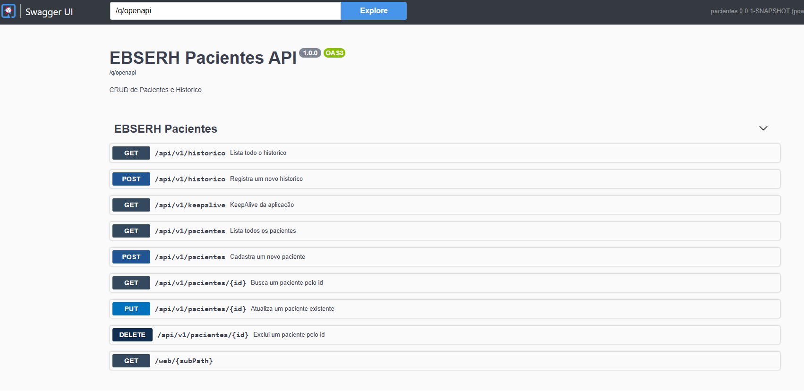

# Teste técnico em JAVA-Backend EBSERH
### Empresa Brasileira de Serviços Hospitalares https://www.gov.br/hubrasil/pt-br

**Teste técnico Desenvolvedor BackEnd - Construção de API**

**Objetivo do teste:**
*Desenvolver uma API CRUD de pacientes, incluindo testes, documentação, banco de dados e readme, com liberdade tecnológica. O mais importante é você usar seu conhecimento técnico, não precisando pensar em regras de negócio, bastando o desenvolvimento do CRUD.*

**Tecnologias e ferramentas:**
- Livre.

**Entregáveis:**
1. Código da API;
2. Testes Unitários;
3. Documentação da API;
4. Readme com instruções de setup e execução;
5. Scripts de banco se houver;
6. Considerações sobre escalabilidade, segurança e manutenção;

**Requisitos:**
> Entregar tudo o que for documentação ou código-fonte em um repositório público no GitHub, as respostas podem ser no **README.md**.

.
.
.
.


### - CONSTRUÇÃO -
*Implementado em QUARKUS e compatível com JAVA-21*

**1. Código da API:**
*repositório git: .\src\main\java\br\gov\ebserh*

**2. Testes Unitários:**
*repositório git: .\test*
*Para executar teste e gerar relatório "mvn clean verify -Dmaven.test.skip=false"
*Relatório já gerado em _TESTE-Unitario-Cobertura-jacoco*

**3. Documentação da API:**
*repositório git: .\\*
*SWAGGER*
> Para Swagger embarcado, acessar por exemplo: http://localhost:8080/q/swagger-ui/

*Caso desejar utilização via POSTMAN ou similar, importe o arquivo de collection EBSERH-Pacientes.postman_collection.json*


**4. Readme com instruções de setup e execução:**
- Para executar a aplicação: _executar.bat
- Edite o JAVA_HOME para um java-jdk de versão 21.
> ATENÇÃO: apontar a variável BD_URL que está comentada em _executar.bat para onde o arquivo SQLite estiver ou alterar no application.properties


**5. Scripts de banco se houver:**
*Diagrama de dados implementado em SQLite:*

> Obs: só possui tipos básicos e primitivos devido às limitações do SQLite.

*Scripts:*
**tbl0001_Paciente definition**
```sql
CREATE TABLE tbl0001_Paciente (
	id INTEGER NOT NULL PRIMARY KEY AUTOINCREMENT,
	nome TEXT,
	cpf TEXT,
	cns TEXT,
	nascimento TEXT,
	telefone TEXT
);
```

**tbl0002_historico**
```sql
CREATE TABLE tbl0002_historico (
	id INTEGER NOT NULL PRIMARY KEY AUTOINCREMENT,
	usuario TEXT,
	origem TEXT,
	requisicao TEXT,
	dhRequisicao TEXT,
	deRequisicao TEXT,
	resposta TEXT,
	dhResposta TEXT,
	deResposta TEXT);
```

**6. Considerações sobre escalabilidade, segurança e manutenção:**
- Aplicação está em JAVA-QUARKUS e configurada para o DOCKER;
- Template já testado em escalabilidade horizontal de 4 PODs com 2 núcleos + 256MB Ram;
- A média de transações por segundo foram de 4.000/seg de consumidores.
- Em cada ação realizada no ENDPOINT, haverá um registro na tabela tbl0002_historico para **TRILHA DE AUDITORIA**;
- **Para a segurança**, foram adicionados parâmetros no application.properties de integração com o SSO (ex: KeyCloak):
```yaml
# Configuracao usada apenas nos testes (@QuarkusTest).
# Define valores para as variaveis que em producao vem do ambiente,
# evitando falha de expansao de ${...} durante o boot dos testes.
MODO_MOCK=false
EBSERH_PACIENTES_TESTE=true

# Configuração de banco de dados
BD_URL=jdbc:sqlite:target/test-pacientes.sqlite
BD_USUARIO=
BD_SENHA=
BD_SIMULTANEO=3

# Configuração de segurança KeyCloak
OIDC_AUTH_SERVER_URL=https://host-keycloak/auth/realms/ebserh
OIDC_CLIENT_ID=pacientes-api
OIDC_SECRET=aaaaabbbbccccc
OIDC_SWAGGER_CLIENT_ID=pacientes-swagger
# Desabilita o OIDC nos testes para o @QuarkusTest subir sem um Keycloak real.
quarkus.oidc.enabled=false

quarkus.log.category."io.quarkus".level=INFO

```
Já no código da Controller, está comentado para realização dos testes desejados:
```java
import javax.annotation.security.RolesAllowed;
import io.quarkus.security.Authenticated;

@Path("/")
@SecuritySchemes( value = {
	@SecurityScheme(
			securitySchemeName = "apiKey", 
			type = SecuritySchemeType.APIKEY, 
			in = SecuritySchemeIn.HEADER, 
			apiKeyName = "X-API-KEY"				
			),
	@SecurityScheme(
			securitySchemeName = "access_token_sso", 
			type = SecuritySchemeType.HTTP, 
			scheme = "bearer", 
			bearerFormat = "jwt"
			)		
	}
)

@Tag(name = "EBSERH Pacientes")
@ApplicationScoped
@Authenticated
public class PacientesController {


```
E para cada endpoint, as roles de perfil de usuário:
```java
@RolesAllowed("pacientes-leitura")
@GET
@Path("/api/v1/pacientes/{id}")
...

@RolesAllowed("pacientes-escrita")
@POST
@Path("/api/v1/pacientes")
```
