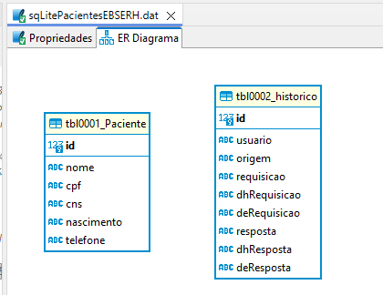

# Teste técnico em JAVA-Backend EBSERH
### Empresa Brasileira de Serviços Hospitalares https://www.gov.br/hubrasil/pt-br

**Teste técnico Desenvolvedor BackEnd - Construção de API**

**Objetivo do teste:**
*Desenvolver uma API CRUD de pacientes, incluindo testes, documentação, banco de dados e readme, com liberdade tecnológica. O mais importante é você usar seu conhecimento técnico, não precisando pensar em regras de negócio, bastando o desenvolvimento do CRUD.*

**Tecnologias e ferramentas:**
- Livre.

**Entregáveis:**
1. Código da API;
2. Testes Unitários;
3. Documentação da API;
4. Readme com instruções de setup e execução;
5. Scripts de banco se houver;
6. Considerações sobre escalabilidade, segurança e manutenção;

**Requisitos:**
> Entregar tudo o que for documentação ou código-fonte em um repositório público no GitHub, as respostas podem ser no **README.md**.


**Teste técnico Desenvolvedor BackEnd - Construção de API**

### - CONSTRUÇÃO -
*Implementado em QUARKUS e compatível com JAVA-21*

**1. Código da API:**
*repositório git: .\src\main\java\br\gov\ebserh*

**2. Testes Unitários:**
*repositório git: .\test*

**3. Documentação da API:**
*repositório git: .\\*
*SWAGGER*

**4. Readme com instruções de setup e execução:**
*Neste mesmo.*

**5. Scripts de banco se houver:**
*Diagrama de dados implementado em SQLite:*

Obs: só possui tipos básicos e primitivos devido às limitações do SQLite.

*Scripts:*
**tbl0001_Paciente definition**
```sql
CREATE TABLE tbl0001_Paciente (
	id INTEGER NOT NULL PRIMARY KEY AUTOINCREMENT,
	nome TEXT,
	cpf TEXT,
	cns TEXT,
	nascimento TEXT,
	telefone TEXT
);
```

**tbl0002_historico**
```sql
CREATE TABLE tbl0002_historico (
	id INTEGER NOT NULL PRIMARY KEY AUTOINCREMENT,
	usuario TEXT,
	origem TEXT,
	requisicao TEXT,
	dhRequisicao TEXT,
	deRequisicao TEXT,
	resposta TEXT,
	dhResposta TEXT,
	deResposta TEXT);
```

**6. Considerações sobre escalabilidade, segurança e manutenção:**
- Aplicação está em JAVA-QUARKUS e configurada para o DOCKER;
- Template já testado em escalabilidade horizontal de 4 PODs com 2 núcleos + 256MB Ram;
- A média de transações por segundo foram de 4.000/seg de consumidores.